# TalentBridge — Architecture

## 0. File & Folder Structure

```
TalentBridge/
│
├── run.py                        # Launch entry point — starts uvicorn on main.py
├── build.spec                    # PyInstaller spec for single-executable build
├── requirements.txt              # Python dependencies
├── partners.json                 # Operator config: all company scraper definitions
├── smtp_config.json              # Operator config: SMTP credentials
├── .env                          # User config: GROQ_API_KEY, REPORT_RECIPIENT
├── .env.example                  # Template for .env
│
├── backend/                      # All server-side logic
│   ├── main.py                   # App init & wiring — calls everyone once at startup
│   ├── api.py                    # FastAPI routes — the HTTP surface of the whole app
│   ├── db.py                     # SQLite connection, schema creation, migrations
│   ├── models.py                 # All DB queries — thin layer above db.py
│   ├── config.py                 # Loads partners.json → upserts companies into DB
│   ├── scraper.py                # Fetches jobs from career sites (CSS/Workday/Playwright)
│   ├── tagger.py                 # Heuristic tagging: level_tag, profile_tags, location_tags
│   ├── matcher.py                # Matching pipeline: scores all unmatched jobs vs CV
│   ├── heuristic_match.py        # Pure scoring function: keyword hits → 0–100 score
│   ├── llm.py                    # Groq API wrapper: CV extraction, taxonomy building
│   ├── skill_taxonomy.py         # Builds & clusters skill taxonomy from job descriptions
│   ├── geo.py                    # City → country lookup via geonamescache
│   ├── email_report.py           # Generates & sends daily/weekly/alert emails via SMTP
│   ├── scheduler.py              # APScheduler: daily scrape, matching, weekly report
│   ├── service.py                # OS startup registration (Windows/macOS/Linux)
│   ├── tray.py                   # pystray system tray icon & menu
│   └── __init__.py
│
├── frontend/
│   ├── templates/                # Jinja2 HTML templates (rendered server-side)
│   │   ├── base.html             # Shared layout, sidebar nav, console log panel
│   │   ├── companies.html        # Main screen: company cards + flat jobs view
│   │   ├── company_detail.html   # Per-company job list with tabs & side panel
│   │   ├── cv.html               # CV upload, keyword management, skill tiers
│   │   ├── tracker.html          # Cross-company application decision tracker
│   │   ├── report.html           # Weekly report viewer (per ISO calendar week)
│   │   ├── alerts.html           # Settings: SMTP recipient, schedule, threshold
│   │   └── jobs.html             # Redirect shim to /companies?view=jobs
│   └── static/
│       ├── css/                  # Stylesheets
│       └── js/                   # Shared JS utilities
│
├── data/                         # Runtime data — gitignored
│   ├── talentbridge.db           # SQLite database (all app state)
│   ├── talentbridge.db-shm       # SQLite WAL shared memory
│   ├── talentbridge.db-wal       # SQLite WAL write-ahead log
│   ├── skills_dump.json          # Debug export of extracted skills
│   └── logs/
│       └── console_*.txt         # Rolling log files (2000 lines each)
│
├── scripts/                      # One-off maintenance scripts (not part of app)
│   ├── clean_taxonomy.py         # Prune/deduplicate skill taxonomy in DB
│   └── cluster_skills.py         # Re-run clustering on existing taxonomy
│
└── project/                      # UI design reference (not served by app)
    ├── TalentBridge.html         # Static HTML mockup used during design phase
    ├── tb-data.js                # Sample data for mockup
    ├── tb-screens.jsx            # React component sketches
    └── tweaks-panel.jsx          # Design tweak panel
```

---

## 0.1 Backend Module Interactions

Each row is one file. Interactions are listed as `→ target (purpose)`.

| File | What it does | Interacts with |
|---|---|---|
| **main.py** | Initialises everything and starts uvicorn | → `db` (create schema) · → `models` (ensure settings table) · → `config` (load partners) · → `scheduler` (start cron jobs) · → `api` (mount FastAPI app) · → `tray` (system tray icon) · → `service` (OS startup registration) |
| **api.py** | All HTTP routes — the only public interface | → `models` (read/write all data) · → `scraper` (trigger scrape & desc fetch) · → `matcher` (trigger matching) · → `llm` (CV keyword extraction) · → `skill_taxonomy` (build & query taxonomy) · → `email_report` (send report on demand) · → `scheduler` (reschedule on settings save) |
| **db.py** | Opens SQLite connection, creates tables, runs migrations | ← used by `models`, `tagger`, `skill_taxonomy`, `geo` (raw connection only) |
| **models.py** | Every SQL query in one place — companies, jobs, CV, matches, decisions, scrape log, settings | → `db` (get connection) · ← called by `api`, `scraper`, `matcher`, `email_report`, `config`, `scheduler` |
| **config.py** | Reads `partners.json` and upserts company rows on startup | → `models` (upsert_company) |
| **scraper.py** | Fetches job listings from career sites using CSS selectors, Workday API, or Playwright | → `models` (upsert_job, mark_expired, log_scrape) · → `tagger` (tag after scrape & desc fetch) · → `geo` (extract location from description) · → `llm` (LLMRateLimitError only — no AI scraping) · → `email_report` (failure alert) |
| **tagger.py** | Pre-computes `level_tag`, `profile_tags`, `location_tags` for every untagged job | → `db` (read untagged jobs, write tags) |
| **matcher.py** | Runs heuristic scoring on all unmatched active jobs against the current CV | → `models` (get CV, get jobs, save matches) · → `heuristic_match` (score each job) · → `skill_taxonomy` (get skill list for gap detection) |
| **heuristic_match.py** | Pure function: keyword hits in job description → score 0–100 + detail breakdown | ← called only by `matcher` |
| **llm.py** | Wraps Groq API: sends prompts, handles rate limits, parses JSON responses | → Groq API (HTTPS) · ← called by `api` (CV extraction), `skill_taxonomy` (taxonomy + clustering) |
| **skill_taxonomy.py** | Builds a skill list from job descriptions (LLM-assisted), then clusters into domains | → `llm` (extract & cluster skills) · → `models` (read settings) · → `db` (write skill_clusters) |
| **geo.py** | Maps city names to countries; extracts city mentions from job descriptions | → `geonamescache` (bundled offline lookup) · ← called by `scraper` (during description fetch) |
| **email_report.py** | Builds HTML emails (daily matches, weekly digest, scrape failure alerts) and sends via SMTP | → `models` (query jobs, matches, decisions for report data) · → `db` (direct queries for weekly report) · → SMTP server (smtplib + STARTTLS) |
| **scheduler.py** | Registers and runs cron jobs in a background thread | → `scraper` (daily scrape) · → `matcher` (daily matching) · → `email_report` (weekly report + daily matches) · → `models` (read schedule settings) |
| **service.py** | Registers app in OS startup (Windows registry / macOS launchd / Linux systemd) | ← called once by `main` at startup |
| **tray.py** | Renders system tray icon with menu (Open Dashboard, Run Scrape, Quit) | → `api` (HTTP calls to trigger scrape) · ← called once by `main` |

---

## 0.2 Frontend Template Interactions

| Template | Screen | Key API calls |
|---|---|---|
| **base.html** | Shared layout — sidebar, console log, status badge | `GET /api/status` (poll) · `GET /api/console/stream` (SSE) |
| **companies.html** | Company cards + flat jobs list, filters, search | `GET /api/status` · `POST /api/scrape/now` · `POST /api/descriptions/fetch` · `GET /api/descriptions/status` · `GET /api/jobs/search` · `POST /api/decisions/{id}` |
| **company_detail.html** | Per-company jobs with All/Matched/Expired tabs | `GET /api/jobs/{id}` (lazy desc fetch) · `POST /api/decisions/{id}` · `POST /api/matches/{id}/override` |
| **cv.html** | CV upload, keyword tiers, match trigger | `POST /cv/upload` · `POST /cv/keywords` · `POST /cv/keyword-types` · `POST /api/match/now` · `GET /api/match/status` · `GET /api/taxonomy/status` · `POST /api/taxonomy/build` · `GET /api/taxonomy/clusters` · `GET/POST /api/experience-level` · `GET/POST /api/preferred-countries` |
| **tracker.html** | Application decisions (Interested / Applied / Skipped) | `POST /api/decisions/{id}` · `DELETE /api/decisions/{id}` |
| **report.html** | Weekly digest viewer, per ISO calendar week | `GET /api/report/weeks` · `POST /report/send` |
| **alerts.html** | Schedule & email settings form | `POST /alerts` (form submit) |

---

## Overview

TalentBridge runs entirely on localhost. A FastAPI process serves the dashboard, runs a background scheduler, and talks to a single SQLite database. No cloud, no accounts, no shared state. Each user runs their own instance.

---

## 1. Static Module Structure

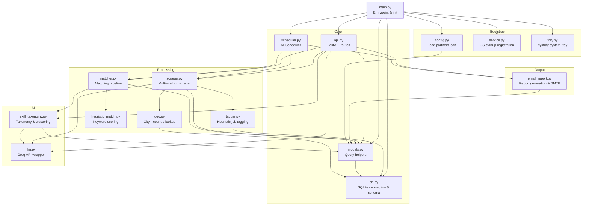

---

## 2. Database Schema

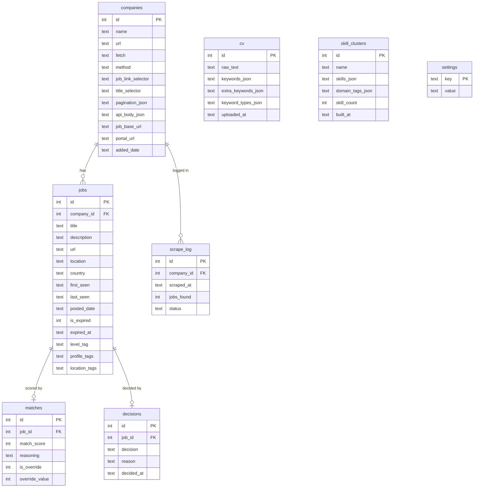

---

## 3. Data Flow — Daily Scrape Cycle

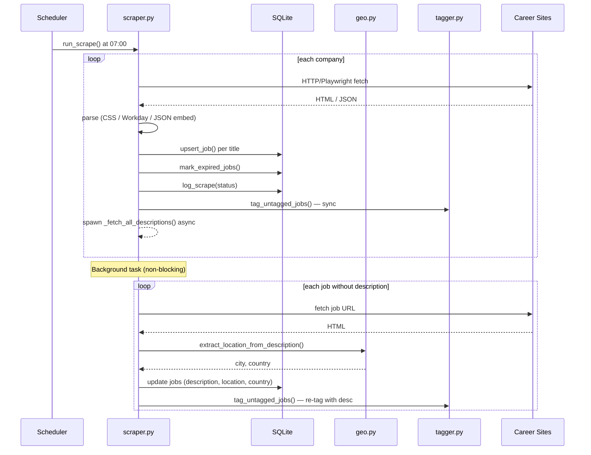

---

## 4. Data Flow — Job Matching

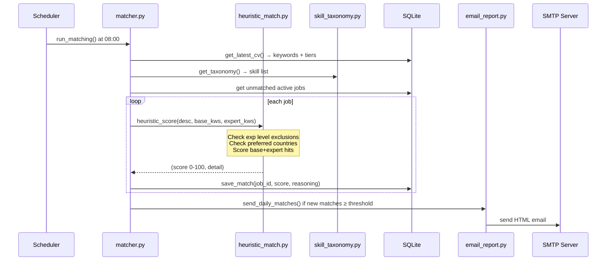

---

## 5. Data Flow — CV Upload & Keyword Extraction

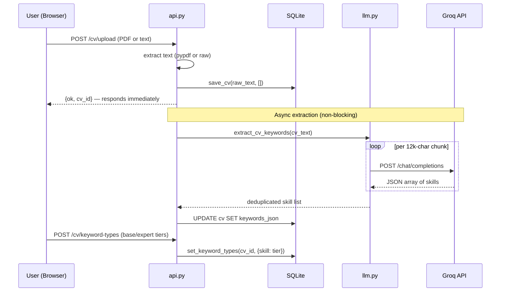

---

## 6. Data Flow — Skill Taxonomy Build

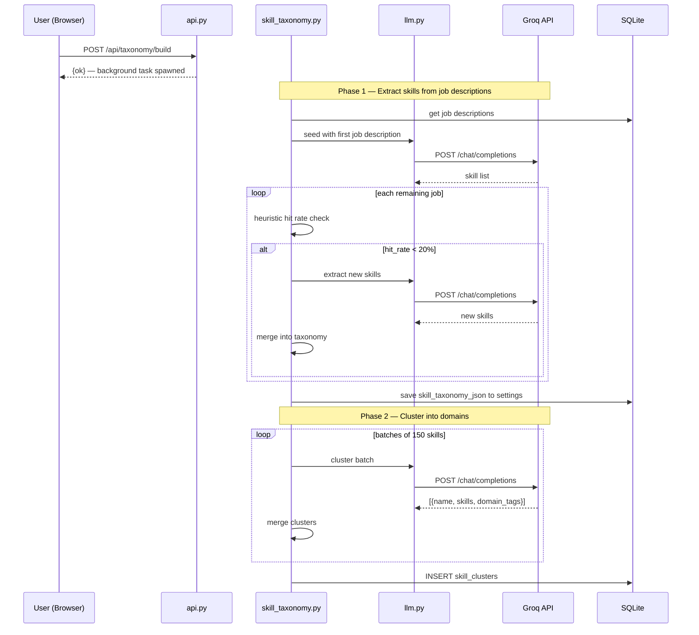

---

## 7. Data Flow — Weekly Report

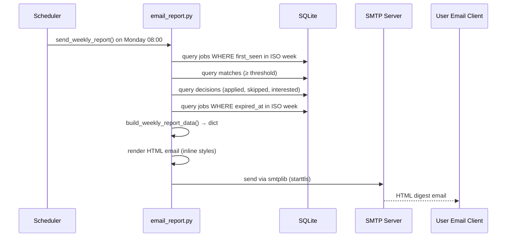

---

## 8. External Interfaces

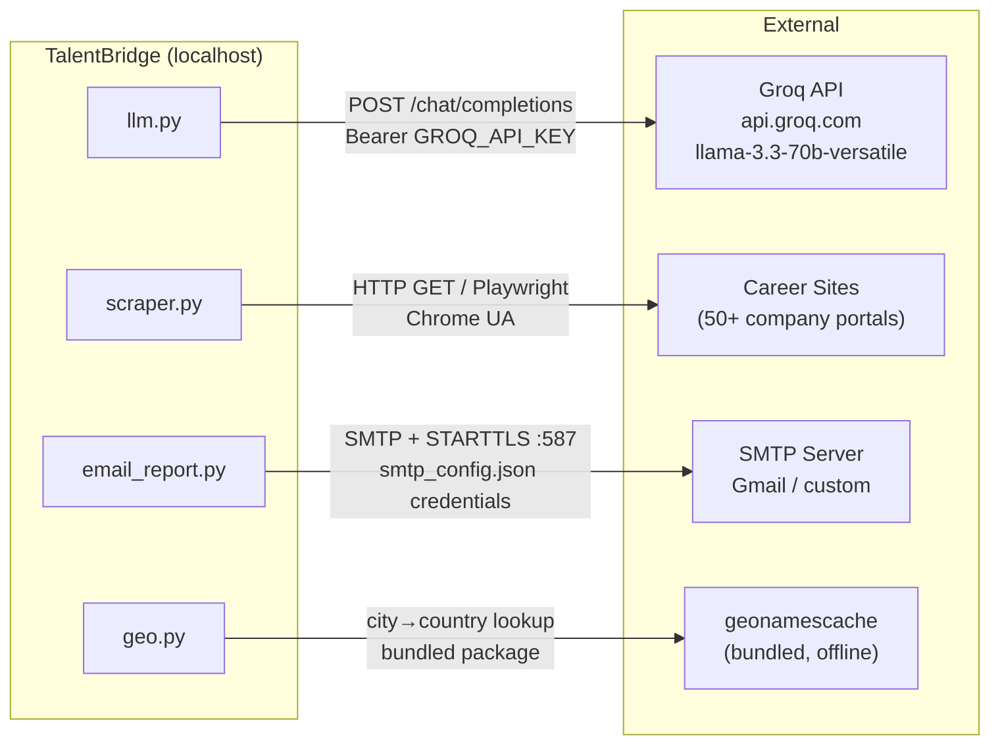

| Interface | Protocol | Auth | Used For |
|---|---|---|---|
| Groq API | HTTPS / OpenAI-compat | `GROQ_API_KEY` in `.env` | CV extraction, taxonomy building |
| Career Sites | HTTP / Playwright | None (public) | Job scraping |
| SMTP | STARTTLS :587 | `smtp_config.json` | Daily + weekly email reports |
| geonamescache | Python package (offline) | None | City → country resolution |

---

## 9. Threading & Concurrency Model

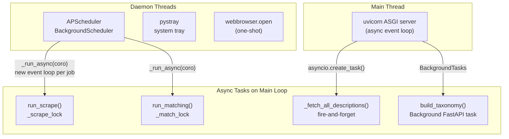

**Key concurrency rules:**
- `_scrape_lock` — prevents concurrent scrape runs
- `_match_lock` — prevents concurrent match runs
- Description fetch is fire-and-forget; scheduler drains all pending tasks before closing its isolated loop
- Scheduler creates a **new event loop per job** (`_run_async`) to avoid cross-thread loop conflicts

---

## 10. Scraper Method Decision Tree

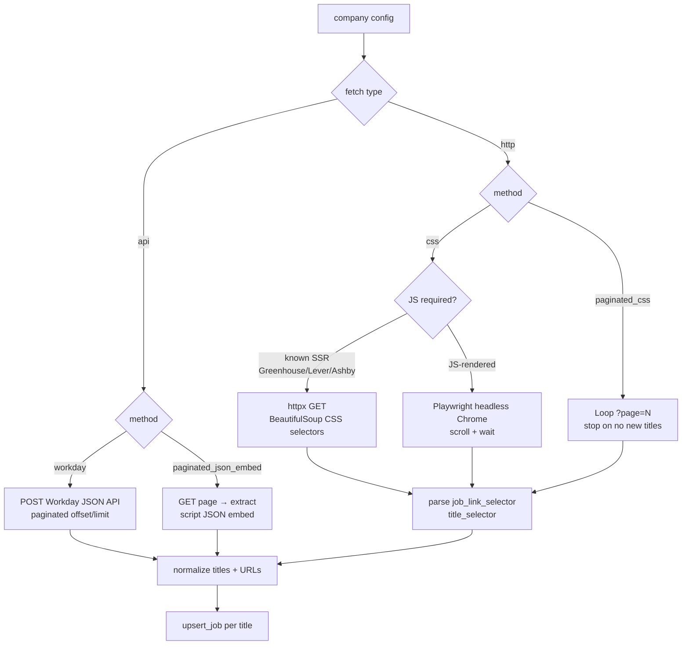

---

## 11. Job Tagging Logic

Tags are pre-computed once after scrape/description fetch and stored in the DB. Filtering is a simple tag lookup — no keyword scanning at runtime.

```mermaid
flowchart TD
    T[job title + description] --> L[Level Tag\nsingle value]
    T --> P[Profile Tags\nmulti-value list]
    T --> LOC[Location Tags\nmulti-value list]

    L --> L1{priority order}
    L1 -->|tech lead / manager / director| MGT[Management]
    L1 -->|intern / ausbildung| STU[Student Jobs]
    L1 -->|entry level| ENT[Entry]
    L1 -->|associate / junior| ASC[Associate]
    L1 -->|senior / principal / staff| SEN[Senior]
    L1 -->|developer / engineer\nAND no senior signals| MID[Mid Level]
    L1 -->|fallback| OTH[Others]

    P --> P1[Match title + description\nagainst domain keyword sets]
    P1 --> P2["[Software Developer,\nDevOps, Data/ML, ...]"]

    LOC --> LOC1[Split on , / | ; and/or]
    LOC1 --> LOC2[Normalize: Remote / Hybrid]
    LOC1 --> LOC3[Match cities via geonamescache]
    LOC2 & LOC3 --> LOC4["[Munich, Remote, ...]"]
```

---

## 12. Heuristic Matching Score

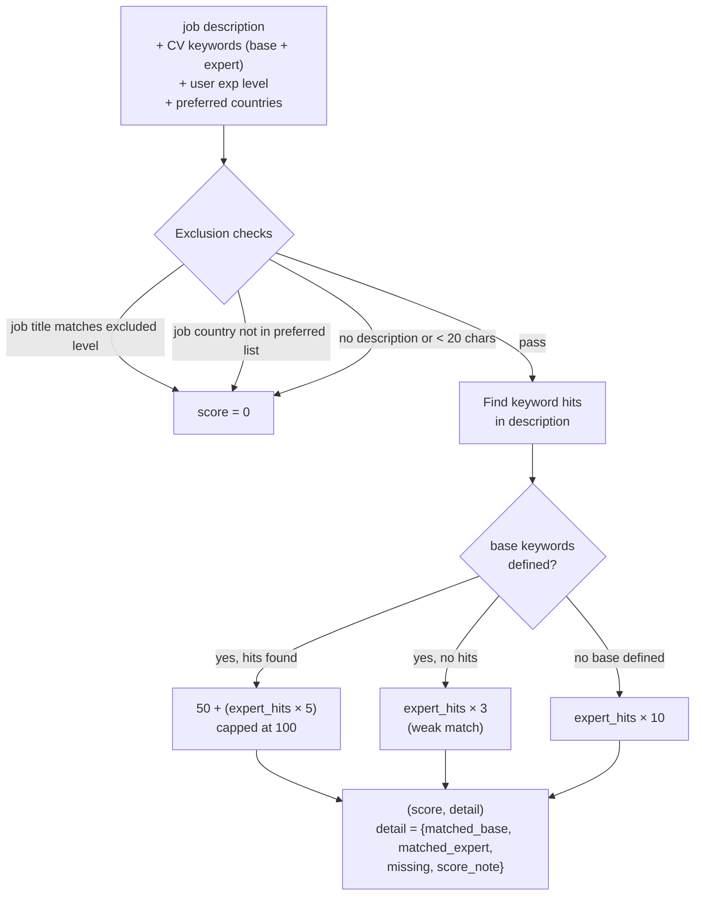

---

## 13. Configuration Files

| File | Managed By | Purpose |
|---|---|---|
| `.env` | User / operator | `GROQ_API_KEY`, `REPORT_RECIPIENT` |
| `smtp_config.json` | Operator | SMTP host, port, user, password |
| `partners.json` | Operator | All company scraper configs |
| `data/talentbridge.db` | App | All runtime data |
| `data/logs/console_*.txt` | App | Rolling log files (2000 lines each) |

Settings that users can change at runtime (scrape time, threshold, report schedule, preferred countries, experience level) are stored in the `settings` table and editable via the dashboard.
